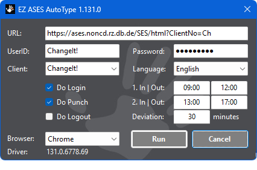
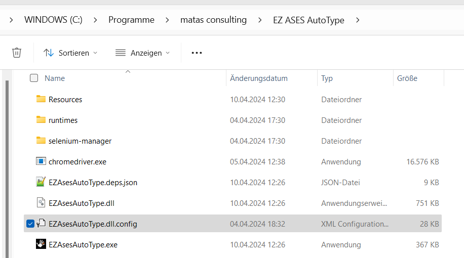
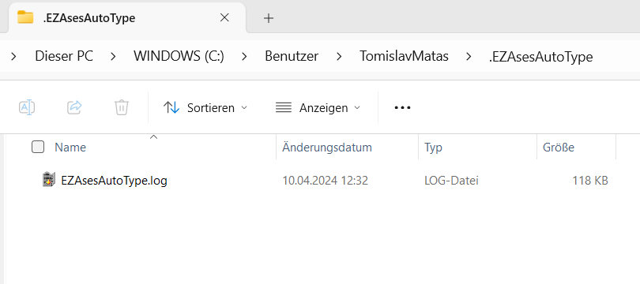

# "EZ ASES AutoType"
The Microsoft Windows Forms application "EZ ASES AutoType" is supposed 
to automate the daily chore of utilizing the virtual punch card system 
"ATOSS Staff Efficiency Suite" also known as "ASES".

# Overview
Start the application and set the desired values in the main dialog:  



Hit the "Run" button and "EZ ASES AutoType" will do the 
following for you completely automatically:

1) Open a new browser instance.
2) Log in with provided credentials.
3) Open the time entry grid.
4) Position the cursor to the time entry grid's last row.
5) Bring up the time pair entry popup dialog.
6) Enter the time pairs.
7) Save the time entry grid.
8) Log out and close browser instance.

Be a bit patient after hitting the "Run" button. The browser instance
startup and initialization may take a few seconds.

You can hit the "Cancel" button at any time. Control will be passed back to
the main dialog as soon as technical possible.

The user settings will be stored within user's profile and reused
on subsequent starts of the application.

## Program startup arguments
The application "EZAsesAutoType.exe" can be 
invoked with optional program startup arguments.
Syntax: 
```CMD
CMD> EZAsesAutoType[.exe] [/DoLogin] [/DoPunch] [/DoLogout] [/Run] [/Close]
```

When invoked with argument "/DoLogin", processing will start immediatly
using the settings from the last invokation. Processing commences until 
the date grid has been displayed. Usefull option do review current data.

When argument "/DoLogin" and "/DoPunch" have been provided, processing 
will start immediatly using all the settings from the last invokation.
Processing commences until the punch data has been typed and then stops. 
Usefull option do review current data.

When argument "/DoLogin", "/DoPunch" and "/DoLogout" have been provided,
processing will start immediatly using all the settings from the last invokation.
Same as if "/Run" has been provided.

When invoked with argument "/Run", processing will start immediatly
using all the settings from the last invokation. Same as if "/DoLogin",
"/DoPunch" and "/DoLogout" have been provided.

Processing can still be stopped at any time by hitting the cancel button.
Once processing has finished, the main dialog will stay active for
further user interaction.

When invoked with "/DoPunch" or "/Run" and "/Close", processing 
will also start immediatly. Once processing has finished, the app will close
automatically except user has hitted the cancel button during processing.

## Time entry shortcuts
* single dot (".") or "now" will evaluate to "now".
  
* "nine" will evaluate to 9am ("09:00").
  
* "five" will evaluate to 5pm ("17:00").
  
* Digits between "0" and "23" will evaluate to respective "hour", e.g.:   
   "7" --> "07:00"   
  "18" --> "18:00"     

* digits between "24" and "59" will evaluate to respective "minute" 
  of current "hour". For example when entered at 9am:   
  "30" --> "09:30"   

* Any entry consisting of three or four digits without the separator ":" 
  will be treated as a time entry in the form of "hhmm". For example:   
   "700" --> "07:00"   
  "1600" --> "16:00"   

All shortcut replacements are implemented within the 
function "FormMain.EvalTimeByFragment()".

## Deviation
If a value greater than 0 (zero) has been set, a random number up to 
the specified deviation will be added or substracted to the 
punch in and punch out time. This makes the punch values vary on each processing. 
This should result in a more organic look of the individual punches.

# Installation 
Execute the setup msi file and follow the instructions. 
You might get prompted to enter admin account credentials during installation.

# Configuration
After installation the configuration file "EZAsesAutoType.dll.config" 
can be found in the same directory as the application's executable 
file "EZAsesAutoType.exe":



All configuration values are set to reasonable default values 
and usually there's no need to modify any of the values manually.

The user settings entered within the main dialog are stored within
an unencrypted file within user's profile. The location will vary
across release versions. It strongly recommended to not edit the
user settings file manually.

The version independent settings will be saved to the windows registry
under the CurrentUser hive also. 

# Logging
The "EZ ASES AutoType" application utilizes the third party logger "log4net". 
All aspects are controlled by settings within the application's configuration 
file "EZAsesAutoType.dll.config". Logging is configured with reasonable default 
values and usually there's no need to modify any of the values manually.

NOTE: The default location for the log file is "%UserProfile%&#92;.EZAsesAutoType":



# Project structure
## "bat" subfolder
Contains some helpful windows batch files.

## "bin" subfolder
Contains required third party binaries as well as the released 
versions of "EZ ASES AutoType".

## "cfg" subfolder
Templates for config files, which can be used with "EZAsesAutoType.exe".

## "doc" subfolder
Contains supplementary documentation about "EZ ASES AutoType".
Most noticeable: "EZAsesAutoType-UserManual.md"

## "src" subfolder
Contains all source code to build "EZAsesAutoType.exe".

# Revision History
## 2024/11/19:TomislavMatas: Version "1.131.0"
* Update "EZSeleniumLib" to version "4.25.1".
* Update "chromedriver.exe" to version "131.0.6778.69".
* Update "msedgedriver.exe" to version "131.0.2903.51".
* Update "log4net" to version "3.0.3".
* Update main dialog screenshot for this "README.md"
  file to "Screenshot-MainDialog-v1.131.0.png".

## 2024/08/06:TomislavMatas: Version "1.127.1"
* Merged content of "EZAsesAutoType-UserManual.md" into this "README.md"
  to have a single point of reference.
  
## 2024/08/05:TomislavMatas: Version "1.127.1"
* Update screenshot of main dialog within this "README.md" file.

## 2024/07/08:TomislavMatas: Version "1.126.4"
* Update screenshot of main dialog within this "README.md" file.

## 2024/05/27:TomislavMatas: Version "1.126.0"  
* Update screenshot of main dialog.  
  
## 2024/04/10:TomislavMatas: Version "1.123.3"
* Add "Overview" section to this "README.md" file.

## 2024/04/04:TomislavMatas: Version "1.0.0"
* Initial version.
