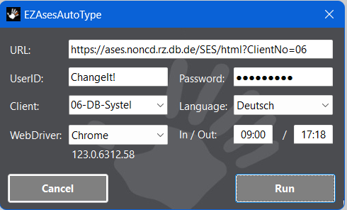

# "EZ ASES AutoType"
The Microsoft Windows Forms application "EZ ASES AutoType" is supposed 
to automate the daily chore of utilizing the virtual punch card system 
"ATOSS Staff Efficiency Suite" also known as "ASES".

## Usage
Start the application ("EZAsesAutoType.exe") and set 
the desired values in the main dialog: 

Hit the "Run" button and "EZ ASES AutoType" will do the 
following for you completly automatically.

1) Open a new browser instance.
2) Log in with provided credentials.
3) Open the time entry grid.
3) Position the cursor to the time entry grid's last row.
4) Bring up the time pair entry popup dialog and enter the time pair.
5) Save the time entry grid.
6) Logout and close browser instance.

Be a bit patient after hitting the "Run" button. The browser instance 
startup and initialization may take a few seconds.

You can hit the "Cancel" button any time. Control will be passed back to 
the main dialog as soon as technical possible.

The user settings will be stored within user's profile and reused 
on subseqeunt starts of the application.

For more details please see the user's manual here:
->< [doc/EZAsesAutoType-UserManual.md](doc/EZAsesAutoType-UserManual.md)

## "bat" subfolder
Containes some helpful windows batch files.

## "bin" subfolder
Containes required third party binaries as well as the released 
versions of "EZAsesAutoType".

## "cfg" subfolder
Templates for config files, which can be used with "EZAsesAutoType.exe".

## "doc" subfolder
Contains supplementary documentation about "EZAsesAutoType".
Most noticable: "EZAsesAutoType-UserManual.md"

## "src" subfolder
Containes all source code to build "EZAsesAutoType.exe".

# Revision History
## 2024/04/10:TomislavMatas: Version "1.123.3"
* Add "Usage" section to this "README.md" file.

## 2024/04/04:TomislavMatas: Version "1.0.0"
* Initial version.
